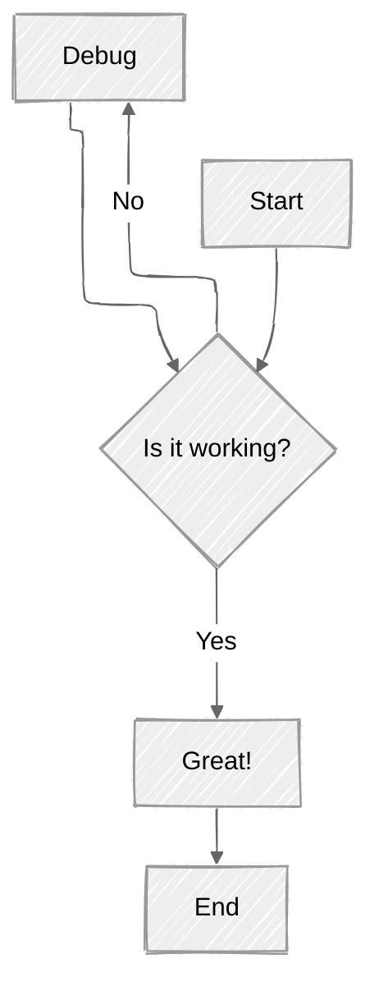
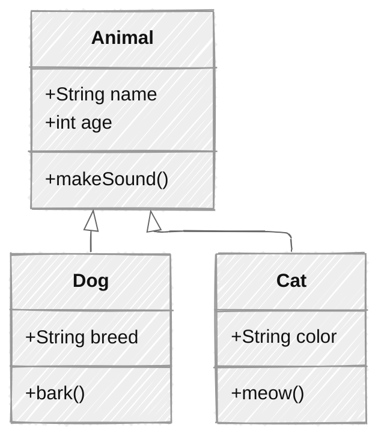
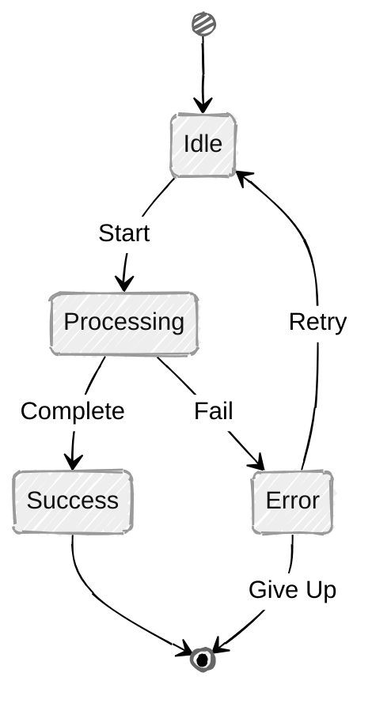
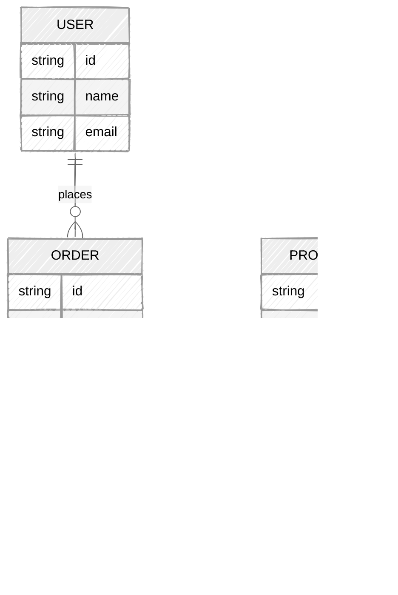

## Introduction

This article demonstrates the advanced features supported by this theme, including Mermaid diagrams, mathematical equations, and rich media embedding using remark-media.

## 📊 Mermaid Diagrams

Mermaid allows you to create diagrams and visualizations using text and code.

### Flowchart

### Sequence Diagram

### Class Diagram

### Gantt Chart

### State Diagram

### Entity Relationship Diagram

## 🧮 Mathematical Equations

This theme supports LaTeX-style mathematical notation using MathJax.

### Inline Math

The quadratic formula is $x = \frac{-b \pm \sqrt{b^2 - 4ac}}{2a}$, which is used to solve equations of the form $ax^2 + bx + c = 0$.

The famous Euler's identity: $e^{i\pi} + 1 = 0$ is considered one of the most beautiful equations in mathematics.

### Block Math

**Pythagorean Theorem:**

$$
a^2 + b^2 = c^2
$$

**Integral Calculus:**

$$
\int_{a}^{b} f(x) \, dx = F(b) - F(a)
$$

**Matrix Representation:**

$$
\begin{bmatrix}
a & b \\
c & d
\end{bmatrix}
\begin{bmatrix}
x \\
y
\end{bmatrix}
=
\begin{bmatrix}
ax + by \\
cx + dy
\end{bmatrix}
$$

**Summation:**

$$
\sum_{i=1}^{n} i = \frac{n(n+1)}{2}
$$

**Limit Definition:**

$$
\lim_{x \to \infty} \left(1 + \frac{1}{x}\right)^x = e
$$

**Partial Derivatives:**

$$
\frac{\partial^2 u}{\partial t^2} = c^2 \nabla^2 u
$$

**Complex Equation:**

$$
\oint_{\partial \Sigma} \mathbf{E} \cdot d\mathbf{l} = -\frac{d}{dt} \iint_{\Sigma} \mathbf{B} \cdot d\mathbf{S}
$$

## 🎵 Audio Player

### APlayer - Single Song

::aplayer{name="Song Title" artist="Artist Name" url="https://www.soundhelix.com/examples/mp3/SoundHelix-Song-1.mp3" cover="https://picsum.photos/300/300"}

### MetingJS - Music Platform Integration

You can embed music from various platforms like NetEase Cloud Music, QQ Music, etc.

::meting{id="1868553" server="netease" type="song"}

## 🎬 Video Player

### DPlayer - Video Player

::dplayer{url="https://commondatastorage.googleapis.com/gtv-videos-bucket/sample/BigBuckBunny.mp4" pic="https://picsum.photos/800/450"}

### ArtPlayer - Advanced Video Player

::artplayer{url="https://commondatastorage.googleapis.com/gtv-videos-bucket/sample/ElephantsDream.mp4" title="Elephants Dream" poster="https://picsum.photos/800/450"}

### Bilibili Video

::bilibili{bvid="BV1xx411c7mD"}

### Native HTML5 Audio

::audio{src="https://www.soundhelix.com/examples/mp3/SoundHelix-Song-2.mp3" controls="true"}

### Native HTML5 Video

::video{src="https://commondatastorage.googleapis.com/gtv-videos-bucket/sample/ForBiggerBlazes.mp4" controls="true" width="100%"}

## 🎨 Combining Features

You can combine these features to create rich, interactive content. For example, explaining an algorithm with both diagrams and mathematical notation:

### Binary Search Algorithm

**Time Complexity:**

$$
T(n) = O(\log n)
$$

**Algorithm Flow:**

**Mathematical Proof:**

At each step, we eliminate half of the remaining elements:

$$
n \rightarrow \frac{n}{2} \rightarrow \frac{n}{4} \rightarrow \cdots \rightarrow 1
$$

After $k$ steps: $\frac{n}{2^k} = 1$, therefore $k = \log_2 n$

## 📝 Conclusion

This theme provides powerful tools for creating rich, interactive content:

- **Mermaid**: Create various diagrams (flowcharts, sequence diagrams, class diagrams, etc.)
- **MathJax**: Write beautiful mathematical equations using LaTeX syntax
- **remark-media**: Embed audio and video players from multiple sources

These features make it perfect for technical blogs, educational content, and documentation.

Happy writing! ✨
